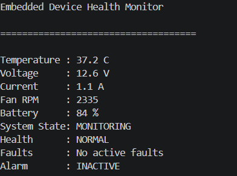

# Embedded Device Health Monitoring System



A **C17 desktop simulation of embedded firmware** that demonstrates a production-oriented, layered firmware architecture for monitoring device health. The application runs on a PC for rapid development and testing while maintaining a Hardware Abstraction Layer (HAL) that allows the same high-level code to be retargeted to microcontrollers such as STM32 with minimal changes.

---

## Project Overview

The Embedded Device Health Monitoring System continuously monitors critical device parameters and evaluates overall system health. It simulates the behavior of a real embedded firmware application by collecting sensor data, processing measurements, detecting faults, managing alarms, and displaying system status through a terminal dashboard.

This project demonstrates industry-standard embedded software design principles including modularity, portability, fault tolerance, and maintainability.

### Monitored Parameters

* Temperature
* Supply Voltage
* Current Consumption
* Fan Speed (RPM)
* Battery Percentage
* Device Health Status
* Fault Conditions
* Alarm State

---

## Screenshot

### Live Terminal Dashboard


Example Output:

```text
Embedded Device Health Monitor

=====================================

Temperature : 37.2 C
Voltage     : 12.6 V
Current     : 1.1 A
Fan RPM     : 2335
Battery     : 84 %

System State: MONITORING
Health      : NORMAL
Faults      : No active faults
Alarm       : INACTIVE
```

---

## Why This Project Exists

* Demonstrates real-world embedded firmware architecture.
* Provides a hardware-independent simulation environment.
* Serves as an interview-ready embedded systems project.
* Shows how firmware can be structured for portability, maintainability, and testing.
* Enables rapid prototyping before deployment to actual hardware.

---

## Key Features

* Layered Architecture (Application → Services → Drivers → HAL)
* Simulated Hardware Sensors
* Real-Time Device Health Monitoring
* Cooperative Task Scheduler
* Fault Detection and Management
* State Machine Based Health Evaluation
* Alarm Management System
* CLI-Based User Interface
* Live Terminal Dashboard
* Ring Buffer Logging
* CRC Data Integrity Checks
* EEPROM Storage Simulation
* STM32 HAL Porting Template
* Unit Testing Framework

---

## System Architecture

The project follows a layered firmware architecture commonly used in production embedded systems.

```text
+---------------------------+
|       Application         |
| CLI, Dashboard, Commands  |
+------------+--------------+
             |
             v
+---------------------------+
|         Services          |
| Sensor Manager            |
| Fault Manager             |
| Alarm Manager             |
| Logger                    |
| Configuration             |
+------------+--------------+
             |
             v
+---------------------------+
|        Middleware         |
| Scheduler                 |
| State Machine             |
| Ring Buffer               |
| CRC                       |
+------------+--------------+
             |
             v
+---------------------------+
|         Drivers           |
| ADC, GPIO, UART, Timer    |
| Storage                   |
+------------+--------------+
             |
             v
+---------------------------+
| Hardware Abstraction Layer|
| PC HAL / STM32 HAL        |
+---------------------------+
```

---

## How It Works

The firmware executes periodic monitoring tasks through a cooperative scheduler.

### Workflow

```text
Sensor Sampling
       |
       v
Data Processing
       |
       v
Threshold Evaluation
       |
       v
Fault Detection
       |
       v
Health State Update
       |
       v
Alarm Handling
       |
       v
Dashboard & Logging
```

### Monitoring Process

1. Sensor values are acquired through the HAL.
2. Sensor Manager collects and validates measurements.
3. Values are compared against configured thresholds.
4. Fault Manager identifies abnormal conditions.
5. State Machine updates system health status.
6. Alarm Service activates warnings if necessary.
7. Logger records events into a ring buffer.
8. Dashboard displays current device status.

---

## Health State Machine

The system health is determined using a simple state machine:

```text
        +---------+
        | NORMAL  |
        +----+----+
             |
             v
        +---------+
        | WARNING |
        +----+----+
             |
             v
        +---------+
        |CRITICAL |
        +---------+
```

### Example Conditions

| Condition                  | State              |
| -------------------------- | ------------------ |
| All values within limits   | NORMAL             |
| Minor threshold violation  | WARNING            |
| Multiple faults detected   | CRITICAL           |
| Battery critically low     | CRITICAL           |
| Fan failure                | WARNING / CRITICAL |
| Over-temperature condition | CRITICAL           |

---

## Technologies Used

### Programming Language

* C17

### Toolchain

* GCC
* Makefile

### Embedded Concepts

* Hardware Abstraction Layer (HAL)
* Cooperative Scheduling
* State Machines
* Fault Management
* Ring Buffers
* CRC Validation
* Persistent Storage
* Embedded Logging

### Supported Platforms

* Linux
* Windows
* WSL
* STM32 (via HAL Port)

---

## Project Structure

```text
Embedded-Device-Health-Monitor/

├── app/
│   ├── main.c
│   └── app.c
│
├── drivers/
│   ├── hal_pc.c
│   ├── hal_adc_pc.c
│   ├── gpio.c
│   ├── timer.c
│   ├── uart.c
│   └── storage.c
│
├── services/
│   ├── sensor_manager.c
│   ├── fault_manager.c
│   ├── logger.c
│   ├── alarm.c
│   └── config.c
│
├── middleware/
│   ├── scheduler.c
│   ├── state_machine.c
│   ├── ring_buffer.c
│   └── crc.c
│
├── include/
│   └── hal_*.h
│
├── tests/
│
├── assets/
│   └── device-health-monitor.png
│
└── README.md
```

---

## Quick Start

### Requirements

* GCC Compiler
* Make
* Linux, WSL, or Windows

### Build and Run

#### Linux / WSL

```bash
make
make run
```

#### Run Unit Tests

```bash
make test
```

#### Windows PowerShell

```powershell
New-Item -ItemType Directory -Force build | Out-Null

gcc -std=gnu11 -Wall -Wextra -Wpedantic -D_POSIX_C_SOURCE=200809L ^
-Iinclude -Iapp -Idrivers -Iservices -Imiddleware ^
app/main.c app/app.c ^
drivers/hal_adc_pc.c drivers/hal_pc.c drivers/gpio.c drivers/storage.c drivers/timer.c drivers/uart.c ^
middleware/crc.c middleware/ring_buffer.c middleware/scheduler.c middleware/state_machine.c ^
services/alarm.c services/config.c services/fault_manager.c services/logger.c services/sensor_manager.c ^
-o build/embedded_device_monitor.exe

.\build\embedded_device_monitor.exe
```

---

## Demo Commands

After running the application:

```text
status
```

Displays current device health and sensor information.

```text
log
```

Displays recent logged events from the ring buffer.

---

## Porting to STM32

The application logic is independent of hardware through the HAL layer.

To run on STM32:

1. Implement HAL functions in `drivers/hal_stm32_template.c`
2. Replace PC-specific drivers with STM32 HAL drivers.
3. Configure timers, UART, ADC, and GPIO peripherals.
4. Rebuild using the STM32 toolchain.

The application and service layers require minimal changes.

---

## Future Enhancements

* STM32 Hardware Deployment
* FreeRTOS Integration
* CAN Bus Monitoring
* MQTT Connectivity
* Remote Telemetry
* Web Dashboard
* Sensor Calibration
* Power Management Features
* Data Analytics and Trending

---

## Contributing

Contributions are welcome.

Possible improvements include:

* Additional unit tests
* Enhanced fault detection algorithms
* STM32 HAL implementation
* CI/CD pipeline integration
* New sensor modules

---

